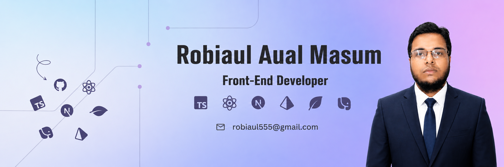

<h1 align="center">Hi 👋, I'm Robiaul Aual Masum</h1>
<h3 align="center">A passionate frontend developer from Bangladesh</h3>

- 🌱 I’m currently learning **ReactJs, NextJs**

- 💬 Ask me about **Frontend development**

- 📫  Feel free to reach me out **robiaul555@gmail.com**

<h3 align="left">Connect with me:</h3>

  

 <h3>
   ## 🛠️ Tech Stack  
 </h3>

### **Frontend**

### **Backend**

### **Tools & Others**

<h3 align="left">Other Languages and Tools:</h3>

    >    

